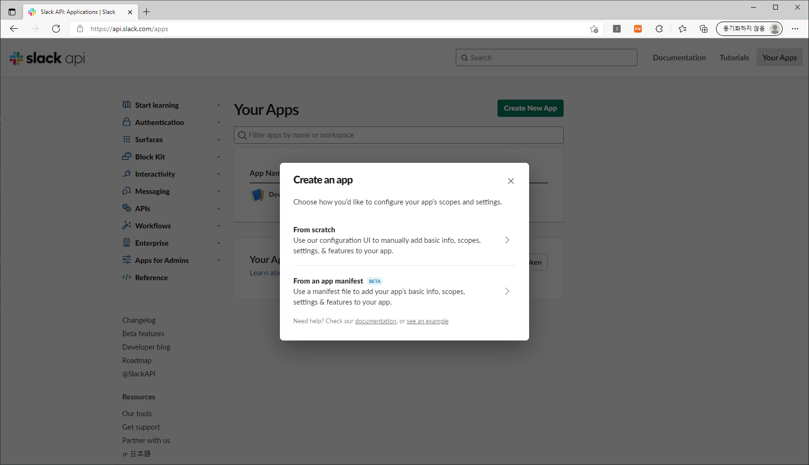
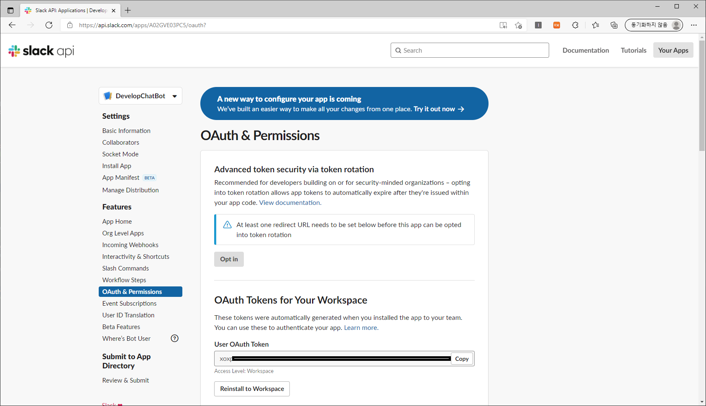
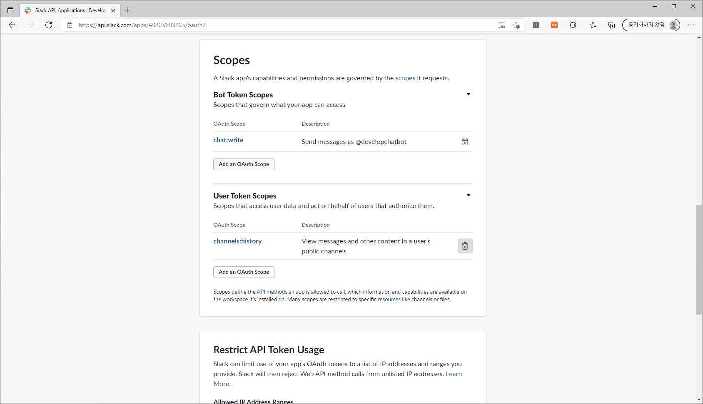
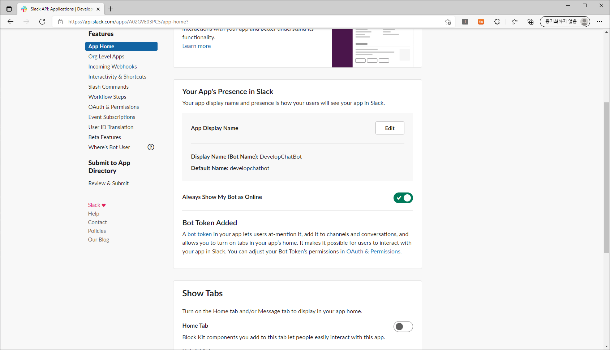
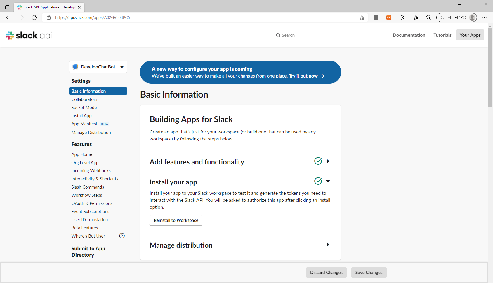
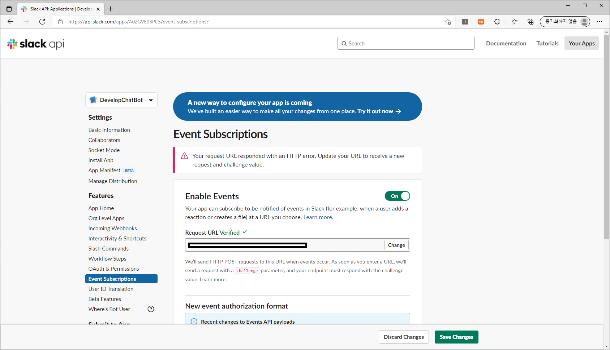
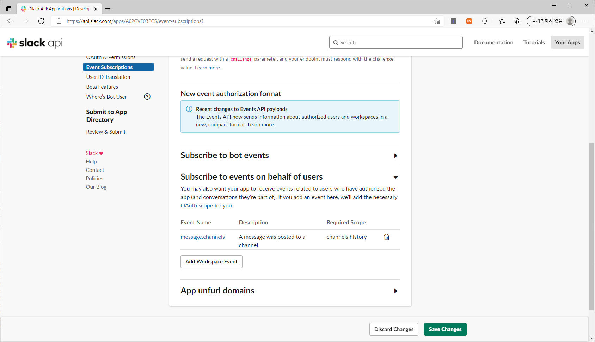

## Spring Boot Slack Bot
- Spring Boot 2.5 및 슬랙 봇 연습

### 실습환경
- Windows 10 WSL2 
- Windows Docker
- Microsoft Store 의 Ubuntu 18.04 LTS 

### Dockerfile
- 도커 이미지 생성하는 명령어
- 아래의 도커 이미지 및 컨테이너 생성/실행 확인 후 0.0.0.0:19090/api/v1/info 접속 하면 확인 가능

```
도커 이미지 및 컨테이너 생성(볼륨 및 포트포워딩)
[root@server-01]# sudo docker build -t spring-demo-docker:0.0.1 .
[root@server-01]# sudo docker run -it -d --name spring-demo -p 19090:9090 -v /mnt/d/data/docker:/usr/data/ spring-demo-docker:0.0.1
[root@server-01]# sudo docker ps
CONTAINER ID   IMAGE                     COMMAND               CREATED          STATUS          PORTS                                         NAMES
6c9e08a179c6   spring-demo-docker:0.0.1  "java -jar app.jar"   17 minutes ago   Up 17 minutes   0.0.0.0:19090->9090/tcp, :::19090->9090/tcp   spring-demo
```

### 슬랙 봇 설정 방법

1. Create New App 클릭 > From Scratch 선택 > 워크 스페이스를 생성합니다.


2. OAuth & Permissions > OAuth Tokens for Your Workspace > 워크스페이스를 설치합니다.


3. OAuth & Permissions > Scopes > Bot Token Scopes 를 추가 합니다.


4. App Home > Your App's Presence in Slack > 봇에 대한 이름을 설정해 줍니다.


5. Basic Infomation > Install Youer App > Install to Workspace 를 클릭합니다.


6. 메세지 Echo를 위해 Event Subscriptions > Enable Events 주소를 설정합니다. 해당 주소는 자신이 만든 API 에서 슬랙이 호출이 Request Body에 challenge 값을 전달해 주는데 이 값을 그대로 Response 하면 됩니다.


7. Event Subscriptions > Subscribe to event on behalf of users > message.channels 를 추가 합니다.


8. 슬랙 앱을 실행 후 자신의 채널에 봇을 초대 하면 됩니다.

9. 모든 설정이 완료되었다면 슬랙에서 채팅 메세지를 보내면 슬랙 -> 내가 만든 API 으로 구독을 받을 수 있습니다. 이 메세지를 가지고 다른 작업을 진행 하면 됩니다.

### 챗봇 딥러닝
- 신경망을 사용하여 자연어처리를 하려면 컴퓨터가 이해할 수 있는 형식으로 변환해야 함
- 가장 쉬운 방법은 One-Hot Encoding을 사용하는 것
- 전체 단어의 수 만큼 벡터의 차원을 만들고 각 단어마다 하나의 차원에 대입

#### 워드 임베딩
1. 0, 1 과 같이 두개의 값이 아니라 0 ~ 1 사이의 벡터값을 가짐.
2. 하나의 단어마다 벡터의 차원을 모두 사용하기에 벡터의 크기를 작게 할 수 있음
3. 비슷한 단어는 벡터의 값이 유사하기 때문에 학습이 더 잘되는 장점이 있음
4. 대표적으로 Word2Vec가 있는데 신경망을 통해 문서 데이터에서 각 단어의 벡터를 학습 가능

- [참고 - Word2Vec](https://dreamgonfly.github.io/blog/word2vec-explained/)
- [참고 - 단어 간 유사도 파악 방법](https://brunch.co.kr/@kakao-it/189)
- [참고 - 자연어 기계학습의 혁명적 진화 - Word2Vec에 대하여](https://www.moreagile.net/2014/11/word2vec.html)

#### 순환 싱경망 RNN(Recurrent Neural Networks)
1. 일반적인 신경망은 피드포워드(feedforward) 방식. 입력에서 출력까지 한쪽 방향만 흐른다.
2. 출력이 다시 입력으로 들어가는것이 특징
3. 이전 출력이 다음번 출력에 영향을 줌
4. 주식, 시계열 데이터, 자연어와 같이 연속적인 상관관계가 있는 분야에서 사용
5. 단 입력 데이터 사이의 거리가 멀어 질 수록 의미를 기억하지 못함
6. 이런 문제를 보완한 것이 LSTM(Long Short Term Memory Networks)

- [참고 - RNN Tutorial](http://aikorea.org/blog/rnn-tutorial-1/)
- [참고 - LSTM 소개](https://brunch.co.kr/@chris-song/9)

#### Seq2Seq(Sequence-to-Sequence)
1. 문장을 그대로 입력 받아서 바로 문장이 출력되도록 하는 방식
2. Encoder와 Decoder 두개의 RNN을 사용하여 구현
3. 단 피자를 주문하거나 물건을 구입하는 등 여러가지 명령어를 수행하는데는 아직 적합하지않음

- [참고 - 문장을 학습하는 딥러닝 RNN의 Seq2Seq 모델 설명](http://aidev.co.kr/chatbotdeeplearning/2273)
- [참고 - 골빈해커님의 Seq2Seq 챗봇](https://github.com/golbin/TensorFlow-Tutorials/tree/master/10%20-%20RNN/ChatBot)

#### Char-CNN 문장의도 파악
1. 보통 챗봇에서 많이 사용하는 방법은 의도와 객체 파악
2. CNN은 대표적으로 이미지 분류에 높은 성능을 보이지만 캐릭터 문자를 처리하는데도 유용
3. 문장을 벡터로 변환하고 특징을 추출한 다음 어떤 의도인지 분류
4. 딥러닝의 장점은 규칙기반과 다르게 복잡한 구문분석 없이도 문장의 의미를 보다 정확하게 파악 가능.

- [참고 - 합성곱 신경망(CNN) 딥러닝을 이용한 한국어 문장 분류](https://docs.likejazz.com/cnn-text-classification-tf/)
- [참고 - CNN으로 문장 분류하기](https://ratsgo.github.io/natural%20language%20processing/2017/03/19/CNN/)
- [참고 - Python과 Tensorflow를 활용한 AI Chatbot 개발 및 실무 적용](https://www.slideshare.net/healess/python-tensorflow-ai-chatbot)
- [참고 - 딥러닝 기반 자연어처리 기법의 최근 연구 동향](https://ratsgo.github.io/natural%20language%20processing/2017/08/16/deepNLP/)

#### RNN으로 개체명 인식 학습
1. NER(Named Entity Recognition)은 문장에서 개체명을 인식하는 것
2. RNN은 문장의 순서에 따라 결과가 다르게 나옴(예. 애플(음식) 파이 와 애플(회사) 컴퓨터)

[출처 - 딥러닝을 사용한 챗봇 개발방법 정리](http://aidev.co.kr/chatbotdeeplearning/3187)